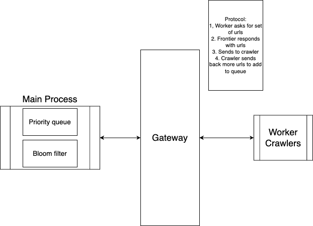

# Frontier

Frontier is an application intended for use along with crawler workers. Frontier acts as the main controller of the worker crawlers, sending it urls to crawl and receiving urls to add back to the prioriy queue.

## Usage
```
mkdir build && cd build
cmake ..
make
./frontier
```

## Architecture
Frontier is intended to be the central manager for workers. Workers will communicate through a unix domain socket

The separation of the frontier and the crawlers was made because of the following reasons
- Scalability: If needed, workers can be run on multiple nodes and the unix domain socket can be exchanged out for a standard TCP/IP connection
- Ease of checkpointing: Instead of maintaing state on multiple processes and machines, only the frontier has to maintain urls that have already been visited
- Separation of concern: This allows multiple developers to work on the crawler in parallel without having to worry about bugs outside of their scope. The frontier and crawlers need only communicate with the correct protocol.




## Priority queue
The underlying priority queue is a standard implementation of a heap. It allows users to define custom comparators. The urls are sorted in the following critieria

- Domain name (priority given to .gov, .edu, etc)
- Host name (priority given to well known hosts such as wikipedia, etc)

The comparator also has incorportaes pesudo randomness to prevent the crawlers from converging to a single domain or host.

## Bloom filter
The bloom filter will act as a set to check if a url has been crawled before. The bloom filter exists in the Frontier application and not in the worker crawlers to simplify duplicate checking and checkpointing. The bloom filter will be written into disk periodically (time to be decided) to "checkpoint" the urls that have been visited by the crawlers.

## Gateway
Frontier and worker crawlers will communicate via unix domain socket. The protocol in which Frontier and worker crawlers will communicate is listed below

```
MessageLength (size_t)
Message:
    Url length (size_t)
    Url (string)
```

The interface for this protocol has been implemented in `lib/FrontierInterface`. Users simply have to call `FrontierInterface::Encode` and `FrontierInterface::Decode` to generate the message to send. The following code snippet is a simple example of how to send and receive messages using this protocol.

```
// Get message length
size_t messageLength = 0;
recv(clientSock, &messageLength, sizeof(messageLength), 0);
messageLength = ntohl(messageLength);

// Get message
std::string message(messageLength, '\0');
recv(clientSock, message.data(), messageLength, MSG_WAITALL)

//Decode message
std::vector<std::string> received = FrontierInterface::Decode(message);

//Encode response
std::vector<std::string> urls = {"google.com", "wikipedia.com", "https://github.com/wbjin"};
std::string response = FrontierInterface::Encode(urls);

// Send response size
int responseSize = htonl(response.size());
send(clientSock, &responseSize, sizeof(responseSize), 0);

// Send response
send(clientSock, response.data(), response.size(), 0);
```